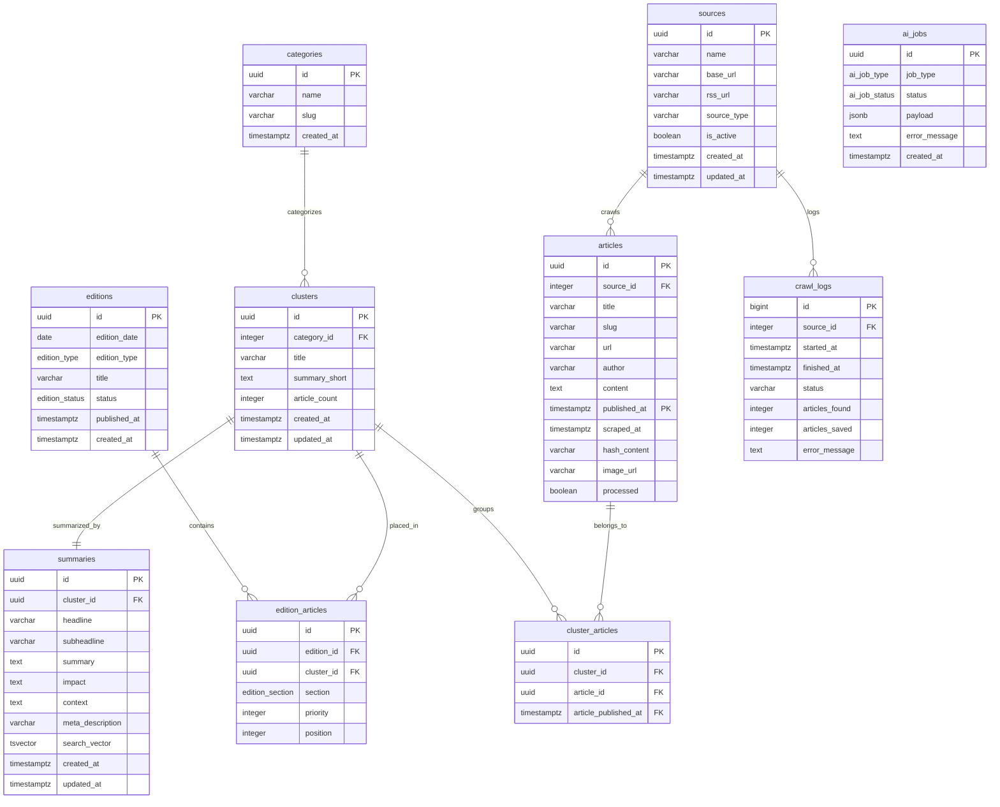

# Database Design Document: Koran AI Indonesia
## Perancang: Senior Database Architect
## Target RDBMS: PostgreSQL 18.x

Dokumen ini mendefinisikan arsitektur database untuk MVP **Koran AI Indonesia**. Rancangan ini ditargetkan untuk performa tinggi, integritas data tingkat produksi, pencarian cepat, dan skalabilitas hingga jutaan artikel dengan skema partitioning dan indeks yang dioptimalkan.

---

## 1. ERD Diagram (Mermaid)

---

## 2. Relasi Antar Tabel & Rationale

### 2.1 Hubungan `sources` -> `articles` (1-to-Many)
* Setiap artikel wajib memiliki satu sumber asal (`source_id` NOT NULL).
* Jika sumber dihapus (`ON DELETE CASCADE`), seluruh artikel dari sumber tersebut ikut terhapus untuk membersihkan data.

### 2.2 Hubungan `categories` -> `clusters` (1-to-Many)
* Kategori adalah data master statis. Klaster artikel dikaitkan ke satu kategori (`category_id`).
* Menggunakan `ON DELETE RESTRICT` pada kategori agar tidak terjadi penghapusan tidak sengaja pada kategori aktif yang memiliki klaster terkait.

### 2.3 Hubungan `clusters` -> `cluster_articles` <- `articles` (Junction Table)
* Menghubungkan klaster AI dengan artikel mentah pendukung.
* Karena `articles` menggunakan skema **Partitioning** berdasarkan kolom `published_at`, relasi foreign key dari tabel non-partitioned (`cluster_articles`) ke tabel partitioned (`articles`) **harus melibatkan kolom partition key**.
* Oleh karena itu, tabel `cluster_articles` memiliki kolom komposit foreign key `(article_id, article_published_at)` yang merujuk langsung ke constraint unique `(id, published_at)` di tabel `articles`.
* Aturan cascade: `ON DELETE CASCADE` di kedua sisi untuk pembersihan otomatis jika klaster atau artikel dihapus.

### 2.4 Hubungan `clusters` -> `summaries` (1-to-1)
* Setiap klaster hasil AI menghasilkan tepat satu rangkuman berita komprehensif.
* Menggunakan UNIQUE constraint pada `cluster_id` di tabel `summaries` untuk menjamin integritas relasi 1-to-1.
* `ON DELETE CASCADE` diterapkan agar jika klaster dibuang, hasil ringkasannya otomatis terhapus.

### 2.5 Hubungan `editions` -> `edition_articles` <- `clusters` (Junction Table)
* Menghubungkan edisi koran dengan klaster berita yang dipilih untuk dipublikasikan.
* Menerapkan UNIQUE constraint pada pasangan `(edition_id, cluster_id)` untuk memastikan satu klaster berita tidak dimasukkan dua kali ke dalam edisi yang sama.
* `ON DELETE CASCADE` pada kedua referensi kunci asing.

---

## 3. Strategi Optimasi untuk 1 Juta+ Artikel

Untuk mengantisipasi penulisan dan pembacaan intensif pada data mentah artikel yang melebihi 1 juta baris, kami mengimplementasikan langkah-langkah optimasi tingkat lanjut berikut:

### 3.1 Declarative Table Partitioning (Articles)
Tabel `articles` di-partition menggunakan metode **RANGE** pada kolom `published_at`. Setiap partisi menampung data selama 1 bulan.
* **Keuntungan**:
  * **Query Pruning**: Query pencarian artikel dalam rentang waktu tertentu hanya memindai partisi yang relevan, memotong waktu eksekusi secara drastis daripada memindai tabel tunggal sebesar 1 juta baris.
  * **Efficient Purging**: Menghapus data lama (misalnya artikel > 1 tahun) cukup dengan melakukan `DROP PARTITION` atau `DETACH PARTITION` yang memakan waktu milidetik tanpa memicu overhead operasi `DELETE` massal yang mengunci tabel dan menghasilkan bloat.
  * **Index Size Control**: Indeks dibuat per partisi, menjaga ukuran indeks tetap kecil dan muat di dalam memori RAM (buffer pool).

### 3.2 Desain Indeks Komposit & Parsial
* **Composite Index**: Pada `edition_articles (edition_id, section, position)` untuk mempercepat query penataan layout halaman koran digital yang membutuhkan urutan presisi.
* **Partial Index**: Pada `articles (processed) WHERE processed = FALSE` untuk mempercepat pemindaian berkala (*polling*) oleh Worker AI terhadap artikel mentah baru yang belum diproses. Indeks ini berukuran sangat kecil karena hanya merekam baris aktif.
* **Unique Composite Index**: Pada `articles (url, published_at)` dan `articles (hash_content, published_at)` sebagai pengganti unique index global karena batasan tabel partitioned di PostgreSQL mewajibkan kolom partisi disertakan dalam constraint UNIQUE.

### 3.3 Pencarian Teks Penuh (Full-Text Search) PostgreSQL
Tabel `summaries` menyimpan kolom `search_vector` bertipe `tsvector`.
* Indeks **GIN (Generalized Inverted Index)** dipasang pada `search_vector` untuk pencarian super cepat.
* Menggunakan trigger otomatis untuk menghasilkan vector pencarian dari gabungan `headline` (bobot 'A'/tertinggi) dan `summary` (bobot 'B'/sedang) setiap kali ada data dimasukkan atau diperbarui.

---

## 4. Rekomendasi Pemeliharaan Partisi (PostgreSQL 18)

Mengingat PostgreSQL 18 membawa peningkatan efisiensi pemrosesan partisi dan concurrent DDL, kami menyarankan:
1. **Dynamic Partition Creation**: Gunakan cron job di tingkat sistem atau PostgreSQL extension `pg_partman` untuk membuat tabel partisi bulan berikutnya secara otomatis secara berkala sebelum masuk bulan baru.
2. **Read-Only Table Compression**: Untuk partisi historis yang berumur lebih dari 6 bulan dan jarang diperbarui, Anda dapat mengubah tipe penyimpanannya ke tablespace kompresi guna menghemat ruang disk VPS.
