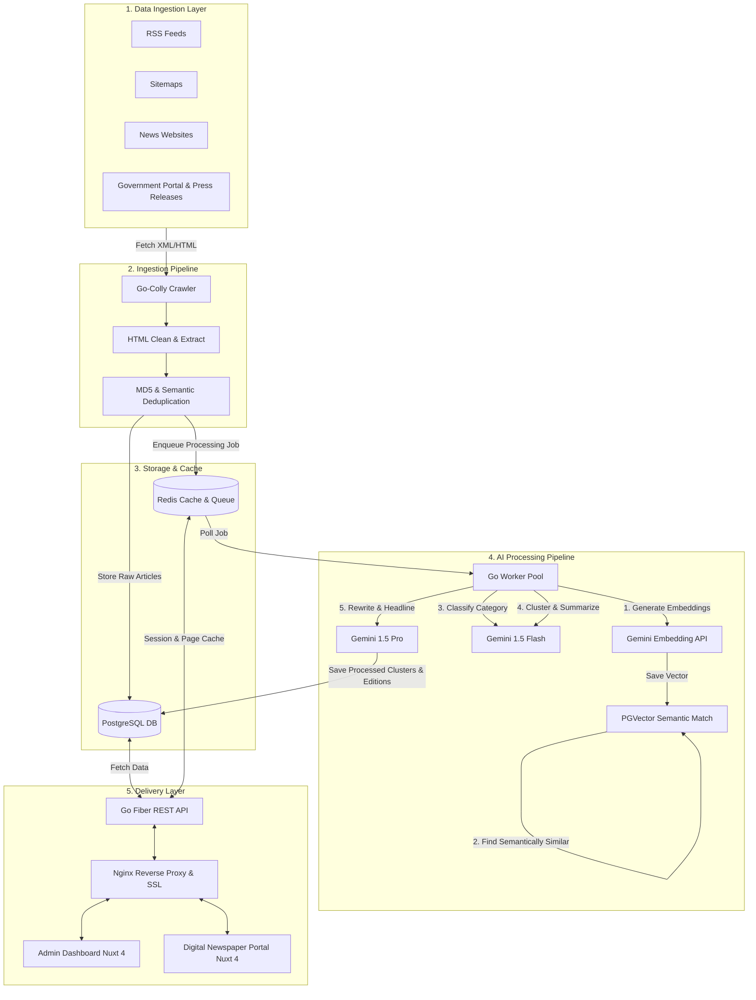
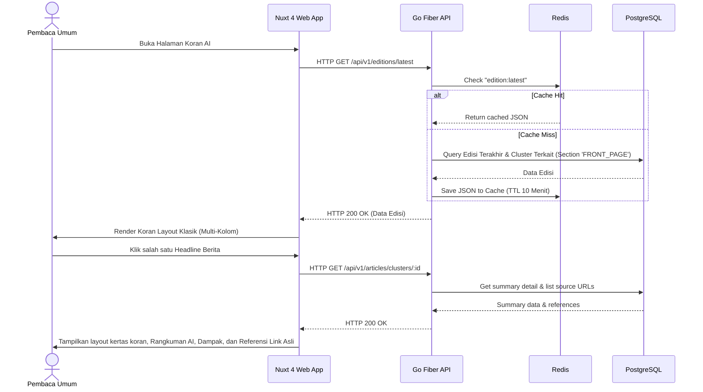
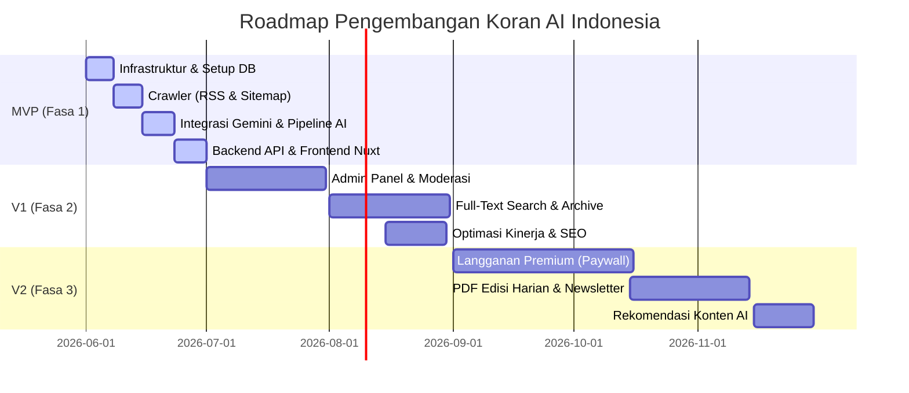

# Product Requirement Document (PRD) & System Architecture
## Proyek: Koran AI Indonesia

---

## 1. Executive Summary

### 1.1 Visi Produk
**Koran AI Indonesia** adalah platform agregasi dan kurasi berita berbasis kecerdasan buatan (AI) yang menyajikan berita digital dalam estetika koran cetak klasik. Dengan memanfaatkan model AI mutakhir (Gemini API), platform ini secara otomatis mengumpulkan, membersihkan, mengelompokkan (clustering), merangkum, dan menulis ulang berita dari berbagai sumber berita terpercaya di Indonesia menjadi tulisan yang objektif, berimbang, bebas clickbait, dan mudah dibaca tanpa mengorbankan fakta.

### 1.2 Masalah yang Dipecahkan (The Problem)
* **Overload Informasi**: Pengguna dibombardir oleh ratusan artikel berita serupa setiap hari dari berbagai media online.
* **Artikel Clickbait & Sensasional**: Judul berita yang menipu demi klik (pageviews) menurunkan kualitas konsumsi informasi masyarakat.
* **Berita Berulang**: Liputan topik yang sama oleh berbagai media membuat pengguna membaca informasi yang berulang-ulang tanpa kedalaman.
* **Kehilangan Nilai Estetika**: Layout web berita modern yang penuh dengan iklan banner agresif merusak pengalaman membaca yang tenang.

### 1.3 Solusi & Value Proposition
* **Satu Topik, Satu Berita**: Menggabungkan puluhan artikel dari berbagai media yang membahas peristiwa yang sama ke dalam satu ringkasan berita komprehensif dengan menyertakan referensi sumber asli.
* **Gaya Klasik Digital**: Tata letak kolom koran tradisional yang bersih, tipografi premium yang ramah mata, dan bebas dari iklan yang mengganggu konsentrasi membaca.
* **Kecerdasan Kurasi (Edisi Harian)**: Pembaca disajikan 3 edisi harian (Pagi, Siang, Malam) layaknya koran cetak tempo dulu, menyajikan rangkuman berita terpenting dalam 12-24 jam terakhir.

### 1.4 Target Pengguna
1. **Pembaca Umum**: Orang yang ingin tetap update dengan berita harian berkualitas tinggi secara cepat dan efisien.
2. **Karyawan & Profesional**: Eksekutif yang memiliki waktu terbatas dan membutuhkan ringkasan eksekutif tentang perkembangan nasional dan global.
3. **Pelaku UMKM**: Pengusaha kecil-menengah yang membutuhkan update regulasi, ekonomi, dan peluang bisnis tanpa terdistraksi berita hiburan/gosip.
4. **Mahasiswa & Akademisi**: Peneliti yang memerlukan arsip berita terstruktur untuk referensi studi kasus.

---

## 2. Product Requirement Document (PRD)

### 2.1 Functional Requirements (Kebutuhan Fungsional)

#### FR-01: News Aggregator (Data Ingestion)
* **RSS Feed & Sitemap Ingestor**: Crawler harus mendukung pembacaan otomatis dari RSS feeds utama media Indonesia (Detik, Kompas, Tempo, Antara, Liputan6, CNN Indonesia, dll.) dan sitemap berita nasional/pemerintah.
* **Metadata Extraction**: Crawler wajib mengambil data: judul asli, URL sumber, konten lengkap (clean text), gambar utama, tanggal publikasi, nama penulis, dan nama penerbit (sumber).
* **HTML Cleaning**: Menghilangkan tag HTML, Javascript, CSS, tracker, iklan, serta teks sampah (seperti "Baca Juga:", "Simak selengkapnya:").

#### FR-02: AI Processing Pipeline
* **Deduplication**: Sistem menyaring artikel yang identik (copypaste/sindikasi) sebelum diproses lebih lanjut menggunakan hash konten.
* **Classification**: Mengklasifikasikan artikel secara otomatis ke dalam 8 kategori utama:
  1. *Nasional* (Berita umum, hukum, sosial)
  2. *Ekonomi* (Bisnis, keuangan, makro/mikro)
  3. *Teknologi* (Gadget, software, startup, sains)
  4. *UMKM* (Peluang bisnis local, regulasi UMKM, kisah inspiratif)
  5. *Pendidikan* (Sekolah, universitas, beasiswa, riset)
  6. *Politik* (Pemerintahan, pemilu, diplomasi)
  7. *Olahraga* (Sepakbola, bulutangkis, olahraga internasional)
  8. *Internasional* (Hubungan global, konflik dunia, berita mancanegara)
* **Semantic Clustering**: Mengelompokkan artikel-artikel dari media berbeda yang membahas isu/kejadian yang sama dalam jendela waktu 12 jam menggunakan kemiripan vektor (*vector embeddings*).
* **AI Summarization**: Membuat rangkuman yang memuat poin-poin utama, fakta penting (siapa, apa, kapan, di mana, mengapa), dampak dari peristiwa tersebut, serta latar belakang konteks.
* **Objective Rewrite**: Menulis ulang berita secara netral, formal, objektif, bebas clickbait, dan menggunakan bahasa Indonesia yang baku (sesuai EBI).
* **Headline & Subheadline Generation**: Menghasilkan judul yang informatif, lugas, menarik secara jurnalistik klasik, dan sub-judul (deck) sebagai ringkasan satu kalimat.

#### FR-03: Koran Digital Layout Engine
* **Multi-column Layout**: Frontend menyusun konten artikel dalam format multi-kolom responsif (menggunakan CSS Grid/Flexbox/Multi-column Layout) yang meniru koran fisik.
* **Visual Hierarchy**: Headline edisi memiliki ukuran font sangat besar di bagian atas, disertai foto utama dengan takarir (caption), dan artikel pendukung disusun di sekitarnya.
* **Responsive Breakpoints**: Layout berubah secara elegan dari 3-4 kolom di desktop ke 1 kolom yang nyaman dibaca di perangkat mobile.

#### FR-04: Daily Edition System
* **Automated Publishing Schedule**: Edisi diterbitkan secara otomatis 3 kali sehari:
  * **Edisi Pagi**: Pukul 06.00 WIB (Memproses berita dari pukul 18.00 hari sebelumnya hingga 05.00 WIB).
  * **Edisi Siang**: Pukul 12.00 WIB (Memproses berita dari pukul 05.00 hingga 11.00 WIB).
  * **Edisi Malam**: Pukul 18.00 WIB (Memproses berita dari pukul 11.00 hingga 17.00 WIB).
* **Editorial Selection**: Sistem AI memilih 1 berita utama (*Top Story / Headline Utama*) untuk ditaruh di halaman depan (Front Page), didukung oleh 4-6 berita penting dari kategori lain.

#### FR-05: Search & Navigation
* **Full Text Search**: Pencarian cepat berbasis PostgreSQL FTS pada judul, ringkasan, dan konten asli.
* **Advanced Filters**: Pencarian dapat difilter berdasarkan rentang tanggal edisi, kategori berita, dan sumber media referensi.

#### FR-06: Archive System
* **Hierarchical Archive**: Pengguna dapat menjelajahi edisi koran terdahulu berdasarkan kalender: Harian (Edisi Pagi/Siang/Malam), Mingguan, Bulanan, dan Tahunan.

#### FR-07: Admin Dashboard
* **Crawler Monitor**: Melihat status crawler aktif, statistik jumlah URL yang diekstrak per sumber, dan status error koneksi.
* **AI Pipeline Status**: Memantau antrean pemrosesan Gemini API (Token usage, cost tracker, error jobs, execution time).
* **Article & Headline Editor (Moderation)**: Administrator dapat mengedit headline hasil AI, mengubah penempatan berita di layout edisi, menyembunyikan artikel, atau memberikan approval manual sebelum edisi terbit.

### 2.2 Non-Functional Requirements (Kebutuhan Non-Fungsional)
* **Performance**: Halaman depan edisi harus termuat di browser dalam < 1.5 detik (First Contentful Paint) menggunakan caching agresif di Redis dan optimasi static rendering di Nuxt.
* **Scalability**: Backend berbasis Go Fiber harus sanggup melayani minimal 2.000 request per detik (RPS) pada VPS 2 vCPU.
* **Availability**: Ketersediaan sistem minimal 99.9% uptime, didukung oleh monitoring process manager systemd.
* **Security**: Enkripsi password menggunakan bcrypt, otentikasi admin via JWT dengan token rotasi pendek (15 menit) dan refresh token (7 hari). Perlindungan API dari scraping luar melalui pembatasan rate limit (Redis rate limiter).

---

## 3. Architecture Diagram

Berikut adalah arsitektur aliran data dan pemrosesan dari sistem **Koran AI Indonesia**:



---

## 4. Database Schema (PostgreSQL DDL)

Kami menggunakan PostgreSQL dengan ekstensi `pgvector` untuk penyimpanan embedding semantik berita guna proses clustering berbasis AI. Full-Text Search diimplementasikan menggunakan `tsvector` bawaan PostgreSQL.

```sql
-- Mengaktifkan ekstensi vector untuk semantic clustering & UUID untuk identifier unik
CREATE EXTENSION IF NOT EXISTS vector;
CREATE EXTENSION IF NOT EXISTS "uuid-ossp";

-- 1. Tabel Roles
CREATE TABLE roles (
    id SERIAL PRIMARY KEY,
    name VARCHAR(50) UNIQUE NOT NULL,
    description TEXT,
    created_at TIMESTAMP WITH TIME ZONE DEFAULT CURRENT_TIMESTAMP,
    updated_at TIMESTAMP WITH TIME ZONE DEFAULT CURRENT_TIMESTAMP
);

-- Insert Default Roles
INSERT INTO roles (name, description) VALUES 
('Superadmin', 'Akses penuh ke semua fitur dan konfigurasi sistem.'),
('Editor', 'Akses untuk moderasi artikel, dashboard AI, edit layout edisi, dan persetujuan publish.'),
('Reader', 'Pengguna umum (opsional untuk bookmark/newsletter premium).');

-- 2. Tabel Users
CREATE TABLE users (
    id UUID PRIMARY KEY DEFAULT uuid_generate_v4(),
    role_id INT REFERENCES roles(id) ON DELETE RESTRICT,
    email VARCHAR(255) UNIQUE NOT NULL,
    password_hash VARCHAR(255) NOT NULL,
    full_name VARCHAR(100) NOT NULL,
    is_active BOOLEAN DEFAULT TRUE,
    created_at TIMESTAMP WITH TIME ZONE DEFAULT CURRENT_TIMESTAMP,
    updated_at TIMESTAMP WITH TIME ZONE DEFAULT CURRENT_TIMESTAMP
);

-- Index untuk mempercepat login berdasarkan email
CREATE INDEX idx_users_email ON users(email);

-- 3. Tabel Sources (Sumber Berita)
CREATE TABLE sources (
    id SERIAL PRIMARY KEY,
    name VARCHAR(100) UNIQUE NOT NULL,
    base_url VARCHAR(255) NOT NULL,
    feed_url VARCHAR(255) NOT NULL,
    feed_type VARCHAR(20) DEFAULT 'rss', -- 'rss', 'sitemap', 'json'
    crawler_rules JSONB, -- Selector CSS untuk konten, gambar, penulis, dll.
    is_active BOOLEAN DEFAULT TRUE,
    created_at TIMESTAMP WITH TIME ZONE DEFAULT CURRENT_TIMESTAMP,
    updated_at TIMESTAMP WITH TIME ZONE DEFAULT CURRENT_TIMESTAMP
);

-- 4. Tabel Categories
CREATE TABLE categories (
    id SERIAL PRIMARY KEY,
    name VARCHAR(50) UNIQUE NOT NULL,
    slug VARCHAR(50) UNIQUE NOT NULL,
    description TEXT,
    created_at TIMESTAMP WITH TIME ZONE DEFAULT CURRENT_TIMESTAMP
);

-- Insert Default Categories
INSERT INTO categories (name, slug, description) VALUES
('Nasional', 'nasional', 'Berita seputar peristiwa nasional, hukum, sosial, dan peristiwa umum di Indonesia.'),
('Ekonomi', 'ekonomi', 'Kabar ekonomi makro, mikro, bisnis, pasar saham, dan keuangan.'),
('Teknologi', 'teknologi', 'Perkembangan teknologi terbaru, gadget, startup, internet, dan sains.'),
('UMKM', 'umkm', 'Berita, tips, regulasi, dan kisah inspiratif seputar Usaha Mikro Kecil dan Menengah.'),
('Pendidikan', 'pendidikan', 'Dunia sekolah, perguruan tinggi, beasiswa, kebijakan pendidikan, dan riset.'),
('Politik', 'politik', 'Dinamika politik nasional, partai politik, pemilu, legislatif, dan eksekutif.'),
('Olahraga', 'olahraga', 'Berita olahraga tanah air dan mancanegara.'),
('Internasional', 'internasional', 'Hubungan luar negeri, isu global, regional, dan peristiwa dunia.');

-- 5. Tabel Articles (Raw articles yang didapat dari crawler)
CREATE TABLE articles (
    id UUID PRIMARY KEY DEFAULT uuid_generate_v4(),
    source_id INT REFERENCES sources(id) ON DELETE CASCADE,
    title VARCHAR(255) NOT NULL,
    slug VARCHAR(255) NOT NULL,
    url VARCHAR(512) UNIQUE NOT NULL,
    author VARCHAR(100),
    body TEXT NOT NULL,
    published_at TIMESTAMP WITH TIME ZONE NOT NULL,
    scraped_at TIMESTAMP WITH TIME ZONE DEFAULT CURRENT_TIMESTAMP,
    hash_content VARCHAR(64) UNIQUE NOT NULL, -- MD5/SHA256 untuk deduplikasi konten
    embedding vector(768), -- Vector embeddings dari Gemini API (text-embedding-004)
    processed BOOLEAN DEFAULT FALSE,
    created_at TIMESTAMP WITH TIME ZONE DEFAULT CURRENT_TIMESTAMP
);

CREATE INDEX idx_articles_published_at ON articles(published_at DESC);
CREATE INDEX idx_articles_processed ON articles(processed) WHERE processed = FALSE;
-- HNSW index untuk pencarian similarity vector (pgvector)
CREATE INDEX idx_articles_embedding ON articles USING hnsw (embedding vector_cosine_ops);

-- 6. Tabel Article Clusters (Pengelompokan Berita Serupa)
CREATE TABLE article_clusters (
    id UUID PRIMARY KEY DEFAULT uuid_generate_v4(),
    category_id INT REFERENCES categories(id) ON DELETE RESTRICT,
    representative_title VARCHAR(255) NOT NULL,
    summary_sentence TEXT, -- Ringkasan singkat satu kalimat untuk layout utama
    created_at TIMESTAMP WITH TIME ZONE DEFAULT CURRENT_TIMESTAMP,
    updated_at TIMESTAMP WITH TIME ZONE DEFAULT CURRENT_TIMESTAMP
);

-- Hubungan M-to-1 dari Articles ke Clusters
ALTER TABLE articles ADD COLUMN cluster_id UUID REFERENCES article_clusters(id) ON DELETE SET NULL;
CREATE INDEX idx_articles_cluster_id ON articles(cluster_id) WHERE cluster_id IS NOT NULL;

-- 7. Tabel Article Summaries (Metadata Rangkuman Terstruktur hasil AI)
CREATE TABLE article_summaries (
    id SERIAL PRIMARY KEY,
    cluster_id UUID REFERENCES article_clusters(id) ON DELETE CASCADE UNIQUE,
    rewritten_title VARCHAR(255) NOT NULL,
    rewritten_body TEXT NOT NULL, -- Konten berita yang ditulis ulang objektif oleh AI
    summary_bullet_points TEXT[], -- Poin penting/fakta penting
    impact TEXT, -- Dampak isu/kejadian
    context TEXT, -- Konteks latar belakang berita
    meta_description VARCHAR(255),
    search_vector tsvector, -- Vector untuk Full-Text Search
    created_at TIMESTAMP WITH TIME ZONE DEFAULT CURRENT_TIMESTAMP,
    updated_at TIMESTAMP WITH TIME ZONE DEFAULT CURRENT_TIMESTAMP
);

-- Index Full Text Search pada judul dan konten ditulis ulang
CREATE INDEX idx_summaries_search ON article_summaries USING gin(search_vector);

-- Trigger untuk update tsvector FTS secara otomatis
CREATE OR REPLACE FUNCTION summaries_trigger() RETURNS trigger AS $$
begin
  new.search_vector :=
    setweight(to_tsvector('indonesian', coalesce(new.rewritten_title,'')), 'A') ||
    setweight(to_tsvector('indonesian', coalesce(new.rewritten_body,'')), 'B');
  return new;
end
$$ LANGUAGE plpgsql;

CREATE TRIGGER tsvectorupdate BEFORE INSERT OR UPDATE
    ON article_summaries FOR EACH ROW EXECUTE FUNCTION summaries_trigger();

-- 8. Tabel Article Images
CREATE TABLE article_images (
    id SERIAL PRIMARY KEY,
    cluster_id UUID REFERENCES article_clusters(id) ON DELETE CASCADE,
    image_url VARCHAR(512) NOT NULL,
    caption TEXT,
    is_primary BOOLEAN DEFAULT FALSE,
    created_at TIMESTAMP WITH TIME ZONE DEFAULT CURRENT_TIMESTAMP
);

CREATE INDEX idx_images_cluster_id ON article_images(cluster_id);

-- 9. Tabel Editions (Edisi Koran Pagi, Siang, Malam)
CREATE TABLE editions (
    id UUID PRIMARY KEY DEFAULT uuid_generate_v4(),
    publish_date DATE NOT NULL,
    edition_type VARCHAR(10) NOT NULL CHECK (edition_type IN ('PAGI', 'SIANG', 'MALAM')),
    title VARCHAR(150) NOT NULL, -- Misal: "Koran AI - Edisi Pagi, Jumat 5 Juni 2026"
    status VARCHAR(20) DEFAULT 'DRAFT' CHECK (status IN ('DRAFT', 'APPROVED', 'PUBLISHED')),
    approved_by UUID REFERENCES users(id) ON DELETE SET NULL,
    published_at TIMESTAMP WITH TIME ZONE,
    created_at TIMESTAMP WITH TIME ZONE DEFAULT CURRENT_TIMESTAMP,
    updated_at TIMESTAMP WITH TIME ZONE DEFAULT CURRENT_TIMESTAMP,
    CONSTRAINT unique_edition_date_type UNIQUE (publish_date, edition_type)
);

CREATE INDEX idx_editions_publish_date ON editions(publish_date DESC);

-- 10. Tabel Edition Articles (Menghubungkan cluster artikel ke suatu Edisi dengan bobot layout)
CREATE TABLE edition_articles (
    id SERIAL PRIMARY KEY,
    edition_id UUID REFERENCES editions(id) ON DELETE CASCADE,
    cluster_id UUID REFERENCES article_clusters(id) ON DELETE CASCADE,
    section_name VARCHAR(50) NOT NULL, -- 'FRONT_PAGE', 'NASIONAL', 'EKONOMI', 'TEKNOLOGI', 'UMKM'
    importance_score INT DEFAULT 1, -- Bobot prioritas (1: Utama/Headline, 2: Secondary, 3: Normal)
    layout_position INT NOT NULL, -- Urutan penataan di grid (1, 2, 3, dst)
    created_at TIMESTAMP WITH TIME ZONE DEFAULT CURRENT_TIMESTAMP,
    CONSTRAINT unique_edition_cluster UNIQUE (edition_id, cluster_id)
);

CREATE INDEX idx_edition_articles_composite ON edition_articles(edition_id, section_name, layout_position);

-- 11. Tabel Crawl Logs
CREATE TABLE crawl_logs (
    id BIGSERIAL PRIMARY KEY,
    source_id INT REFERENCES sources(id) ON DELETE CASCADE,
    started_at TIMESTAMP WITH TIME ZONE NOT NULL,
    finished_at TIMESTAMP WITH TIME ZONE,
    status VARCHAR(20) NOT NULL, -- 'RUNNING', 'SUCCESS', 'FAILED'
    articles_found INT DEFAULT 0,
    articles_saved INT DEFAULT 0,
    error_message TEXT,
    created_at TIMESTAMP WITH TIME ZONE DEFAULT CURRENT_TIMESTAMP
);

-- 12. Tabel AI Jobs
CREATE TABLE ai_jobs (
    id UUID PRIMARY KEY DEFAULT uuid_generate_v4(),
    job_type VARCHAR(50) NOT NULL, -- 'CLUSTERING', 'SUMMARIZATION', 'REWRITE', 'EDITION_BUILD'
    status VARCHAR(20) NOT NULL, -- 'PENDING', 'PROCESSING', 'COMPLETED', 'FAILED'
    payload JSONB,
    token_input INT DEFAULT 0,
    token_output INT DEFAULT 0,
    cost_usd NUMERIC(10, 6) DEFAULT 0.000000,
    error_message TEXT,
    created_at TIMESTAMP WITH TIME ZONE DEFAULT CURRENT_TIMESTAMP,
    updated_at TIMESTAMP WITH TIME ZONE DEFAULT CURRENT_TIMESTAMP
);

-- 13. Tabel Search Logs
CREATE TABLE search_logs (
    id BIGSERIAL PRIMARY KEY,
    user_id UUID REFERENCES users(id) ON DELETE SET NULL, -- NULL untuk guest
    query_string VARCHAR(255) NOT NULL,
    results_count INT DEFAULT 0,
    ip_address VARCHAR(45),
    searched_at TIMESTAMP WITH TIME ZONE DEFAULT CURRENT_TIMESTAMP
);
```

---

## 5. API Design (Go Fiber REST API)

Semua endpoint API mengembalikan format JSON standar:
```json
{
  "success": true,
  "message": "Deskripsi response",
  "data": null,
  "meta": null
}
```

### 5.1 Auth API

#### POST `/api/v1/auth/login`
* **Deskripsi**: Autentikasi Admin/Editor dan penyerahan JWT.
* **Request Payload**:
  ```json
  {
    "email": "editor@koranai.id",
    "password": "PasswordSangatRahasia123!"
  }
  ```
* **Validation**: Email wajib format email, password minimal 8 karakter.
* **Success Response (200 OK)**:
  ```json
  {
    "success": true,
    "message": "Login successful",
    "data": {
      "token": "eyJhbGciOiJIUzI1NiIsInR5cCI6IkpXVCJ9...",
      "refresh_token": "def456...",
      "user": {
        "id": "a0f3d4ef-1234...",
        "full_name": "Budi Santoso",
        "role": "Editor"
      }
    }
  }
  ```

#### POST `/api/v1/auth/refresh`
* **Deskripsi**: Memperbarui JWT Token yang kedaluwarsa.
* **Request Payload**:
  ```json
  {
    "refresh_token": "def456..."
  }
  ```

---

### 5.2 Articles & Clusters API

#### GET `/api/v1/articles/clusters`
* **Deskripsi**: Mengambil daftar klaster artikel terproses.
* **Query Parameters**:
  * `category` (string, optional): Slug kategori (e.g. `ekonomi`).
  * `page` (int, default=1): Nomor halaman.
  * `limit` (int, default=10): Jumlah item per halaman.
* **Success Response (200 OK)**:
  ```json
  {
    "success": true,
    "message": "Clusters retrieved successfully",
    "data": [
      {
        "cluster_id": "c1b0d2ef-4321-...",
        "category": "Ekonomi",
        "title": "BI Tahan Suku Bunga Acuan BI-Rate di Level 6,25%",
        "summary_sentence": "Bank Indonesia memutuskan mempertahankan BI-Rate di level 6,25 persen untuk menjaga stabilitas rupiah dan inflasi.",
        "published_at": "2026-06-05T18:00:00Z",
        "sources_count": 8,
        "primary_image": "https://storage.koranai.id/images/cluster_bi_rate.jpg"
      }
    ],
    "meta": {
      "current_page": 1,
      "total_pages": 5,
      "total_items": 48
    }
  }
  ```

#### GET `/api/v1/articles/clusters/:id`
* **Deskripsi**: Detail rangkuman klaster beserta sumber referensi berita.
* **Success Response (200 OK)**:
  ```json
  {
    "success": true,
    "message": "Cluster details retrieved",
    "data": {
      "cluster_id": "c1b0d2ef-4321-...",
      "category": "Ekonomi",
      "headline": "BI Tahan Suku Bunga Acuan BI-Rate di Level 6,25%",
      "summary": {
        "rewritten_title": "Keputusan Stabilitas: Bank Indonesia Pertahankan BI-Rate Pada Batas 6,25 Persen",
        "body": "Jakarta, Koran AI - Rapat Dewan Gubernur Bank Indonesia (RDG BI) memutuskan untuk mempertahankan BI-Rate sebesar 6,25%...",
        "bullet_points": [
          "BI-Rate dipertahankan di level 6,25% untuk menjaga inflasi terkendali.",
          "Suku bunga Deposit Facility tetap 5,50% dan Lending Facility tetap 7,00%.",
          "Keputusan ini sejalan dengan fokus menjaga penguatan nilai tukar Rupiah."
        ],
        "impact": "Stabilitas nilai tukar Rupiah diperkirakan terjaga, namun pertumbuhan penyaluran kredit perbankan mungkin tertahan akibat suku bunga yang masih tinggi.",
        "context": "Sebelumnya, BI menaikkan suku bunga sebesar 25 bps pada bulan April sebagai langkah pre-emptive menghadapi ketidakpastian global."
      },
      "images": [
        {
          "url": "https://storage.koranai.id/images/cluster_bi_rate.jpg",
          "caption": "Gedung Bank Indonesia, Thamrin, Jakarta.",
          "is_primary": true
        }
      ],
      "references": [
        { "name": "Kompas", "url": "https://nasional.kompas.com/read/..." },
        { "name": "Detik", "url": "https://finance.detik.com/read/..." }
      ]
    }
  }
  ```

---

### 5.3 Editions & Archives API

#### GET `/api/v1/editions/latest`
* **Deskripsi**: Mengambil edisi koran digital terbitan terbaru (Pagi/Siang/Malam) untuk ditampilkan di beranda.
* **Success Response (200 OK)**:
  ```json
  {
    "success": true,
    "message": "Latest edition retrieved",
    "data": {
      "edition_id": "e4f8a123-5678-...",
      "title": "Koran AI - Edisi Malam, Jumat 5 Juni 2026",
      "publish_date": "2026-06-05",
      "edition_type": "MALAM",
      "published_at": "2026-06-05T18:00:00Z",
      "sections": {
        "FRONT_PAGE": [
          {
            "cluster_id": "c1b0d2ef-4321-...",
            "importance_score": 1,
            "layout_position": 1,
            "title": "BI Tahan Suku Bunga Acuan BI-Rate di Level 6,25%",
            "excerpt": "Bank Indonesia memutuskan mempertahankan BI-Rate di level 6,25 persen untuk menjaga stabilitas...",
            "primary_image": "https://storage.koranai.id/images/cluster_bi_rate.jpg"
          }
        ],
        "NASIONAL": [...],
        "EKONOMI": [...]
      }
    }
  }
  ```

#### GET `/api/v1/archives`
* **Deskripsi**: Mengambil arsip edisi terdahulu (paginated).
* **Query Parameters**:
  * `year` (int, optional): Contoh `2026`.
  * `month` (int, optional): Contoh `6` (Juni).
  * `page` (int, default=1).
  * `limit` (int, default=15).

---

### 5.4 Search API

#### GET `/api/v1/search`
* **Deskripsi**: Full-Text Search berita terproses.
* **Query Parameters**:
  * `q` (string, required): Kata kunci pencarian (e.g. `nilai rupiah`).
  * `category` (string, optional).
  * `start_date` (string, YYYY-MM-DD, optional).
  * `end_date` (string, YYYY-MM-DD, optional).
* **Validation**: Parameter `q` minimal 3 karakter.

---

### 5.5 Admin Control & Monitoring API (Secured JWT)

#### GET `/api/v1/admin/crawler/status`
* **Deskripsi**: Monitoring status crawler.
* **Response**: Statistik scraping, domain aktif, histori error.

#### POST `/api/v1/admin/editions/generate`
* **Deskripsi**: Memicu pembuatan draft edisi secara manual oleh AI untuk rentang waktu tertentu.
* **Request Payload**:
  ```json
  {
    "publish_date": "2026-06-05",
    "edition_type": "MALAM"
  }
  ```

#### PUT `/api/v1/admin/editions/:id/publish`
* **Deskripsi**: Approval final dari editor untuk mempublikasikan edisi ke khalayak umum.

---

## 6. UI/UX Wireframe & Navigation Flow

### 6.1 Sitemap
```
├── / (Home/Edisi Terbaru - Front Page)
├── /edisi (Arsip Kalender Koran)
│   ├── /edisi/:date/:type (Detail Edisi Khusus, e.g. /edisi/2026-06-05/pagi)
├── /kategori
│   ├── /kategori/nasional
│   ├── /kategori/ekonomi
│   ├── /kategori/teknologi
│   └── /kategori/umkm
├── /baca/:cluster_id (Halaman Baca Rangkuman Berita Lengkap)
├── /pencarian (Hasil Pencarian FTS)
└── /admin (Dashboard Admin - Restricted)
    ├── /admin/crawler (Logs crawler)
    ├── /admin/ai-jobs (Status pipeline Gemini)
    └── /admin/moderation (Review draft edisi sebelum publish)
```

### 6.2 User Flow



---

### 6.3 ASCII Wireframes

#### 6.3.1 Desktop Layout (Web - 1440px)
Gaya koran klasik menggunakan grid tebal hitam, logo bergaya gothic/serif kapital ("KORAN AI"), garis pemisah ganda tipis, tanggal edisi, dan penataan kolom bervariasi.

```
================================================================================
|                               KORAN AI INDONESIA                             |
|                           - Suara Digital, Gaya Klasik -                     |
|==============================================================================|
| Edisi Malam | Jumat, 5 Juni 2026 | Rp 0 (Bebas Iklan) | No. 129 Tahun ke-1   |
|==============================================================================|
|                                                                              |
|  [FOTO UTAMA: Gedung BI]          | HEADLINE UTAMA:                          |
|                                   | BI TAHAN SUKU BUNGA DI LEVEL 6.25%       |
|                                   | ---------------------------------------  |
|  Caption: Gedung Bank Indonesia,  | Jakarta, Koran AI - Rapat Dewan Gubernur |
|  Thamrin, Jakarta.                | Bank Indonesia memutuskan untuk kembali  |
|  -------------------------------  | menahan suku bunga acuan (BI-Rate) di    |
|  NASIONAL                         | level 6,25 persen. Langkah ini diambil   |
|  Kebijakan Transportasi Baru      | untuk memperkuat stabilisasi nilai tukar |
|  Mulai Berlaku Bulan Depan        | Rupiah dari gejolak ketidakpastian pasar |
|  ...............................  | global, serta memastikan tingkat inflasi |
|  Pemerintah mengumumkan           | tetap terkendali dalam sasaran sasaran   |
|  penyesuaian tarif KRL Jabodetabek| 2,5±1% pada sisa tahun 2026.             |
|  berbasis NIK yang menuai pro-    |                                          |
|  kontra di masyarakat. [Hlm 2]    | Dampak:                                  |
|                                   | Suku bunga kredit bank tetap tinggi,     |
|  TEKNOLOGI                        | namun stabilitas pasar keuangan domestik |
|  Gemini 1.5 Pro Bantu UKM         | akan memicu modal asing masuk kembali.   |
|  Optimalkan Manajemen Logistik    |                                          |
|  ...............................  | Referensi: Kompas, Detik, Tempo (8 Media)|
|==============================================================================|
| EKONOMI                           | UMKM                                     |
| Nilai Ekspor Sawit Meningkat      | Program Kredit Bunga Rendah bagi Usaha   |
| Mikro Dikembangkan di Wilayah Jateng | Mikro Resmi Diperpanjang Hingga 2027  |
| ................................. | ........................................ |
| Ekspor CPO Indonesia ke Uni Eropa | Kementerian Koperasi dan UKM menetapkan  |
| mengalami lonjakan volume sebesar | perpanjangan subsidi bunga KUR sebesar   |
| 12% pada kuartal pertama. [Hlm 3] | 3% untuk memperkuat modal usaha. [Hlm 4] |
================================================================================
```

#### 6.3.2 Mobile Layout (Responsive - 375px)
Untuk mobile, format menyempit menjadi 1 kolom vertikal namun tetap mempertahankan batas garis koran, logo serif besar, dan blok kutipan khas koran.

```
=====================================
|        KORAN AI INDONESIA         |
|===================================|
| Edisi Malam | Jumat, 5 Juni 2026  |
|===================================|
|                                   |
|          HEADLINE UTAMA           |
|  BI Tahan Suku Bunga 6.25%        |
|                                   |
|  [ FOTO UTAMA: Gedung BI ]        |
|                                   |
|  Jakarta, Koran AI - Rapat        |
|  Dewan Gubernur BI memutuskan     |
|  mempertahankan suku bunga acuan  |
|  tetap di angka 6,25% demi        |
|  stabilitas Rupiah...             |
|                                   |
|  [Baca Selengkapnya ->]           |
|                                   |
|-----------------------------------|
|                                   |
|  EKONOMI                          |
|  Subsidi KUR 3% Diperpanjang      |
|  Kemenkop UKM memperpanjang       |
|  program subsidi bunga untuk      |
|  pengusaha mikro...               |
|                                   |
|  [Baca Selengkapnya ->]           |
|                                   |
|-----------------------------------|
|                                   |
|  NASIONAL                         |
|  Tarif KRL Berbasis NIK Mulai     |
|  Berlaku Bulan Depan...           |
|                                   |
=====================================
```

---

## 7. Deployment Plan (Debian Server 24.04 - Baremetal/VPS)

Deployment akan dilakukan secara native langsung pada server Debian 24.04 LTS tanpa menggunakan Docker. Seluruh proses aplikasi Go Fiber diatur menggunakan `systemd`, file aset statis disajikan secara langsung oleh `Nginx` (atau proxying ke Nuxt Node service), database PostgreSQL dan Redis berjalan secara native di server.

### 7.1 Struktur Folder Server
```
/var/www/koran-ai/
├── backend/                  # Direktori binary Go & config
│   ├── koran-api             # Compiled Go Binary
│   └── config.env            # Environment Variables
├── frontend/                 # Direktori aplikasi Nuxt 4 (SSR node output / Static dist)
│   ├── .output/              # Output hasil `npm run build`
│   └── package.json
├── storage/                  # Penyimpanan gambar lokal
│   └── uploads/              # Gambar berita hasil unduhan crawler
└── scripts/                  # Script utility (backup, database migration)
    └── backup_db.sh
```

### 7.2 Nginx Reverse Proxy Configuration (`/etc/nginx/sites-available/koran-ai.conf`)
```nginx
# Cache static asset frontend
proxy_cache_path /var/cache/nginx/nuxt_cache levels=1:2 keys_zone=nuxt_cache:10m max_size=1g inactive=60m use_temp_path=off;

server {
    listen 80;
    server_name koranai.id www.koranai.id;
    return 301 https://$host$request_uri;
}

server {
    listen 443 ssl http2;
    server_name koranai.id www.koranai.id;

    # SSL Configuration (Let's Encrypt Certbot)
    ssl_certificate /etc/letsencrypt/live/koranai.id/fullchain.pem;
    ssl_certificate_key /etc/letsencrypt/live/koranai.id/privkey.pem;
    ssl_protocols TLSv1.2 TLSv1.3;
    ssl_ciphers HIGH:!aNULL:!MD5;
    ssl_prefer_server_ciphers on;

    client_max_body_size 10M;

    # 1. Frontend (Nuxt 4 Node SSR)
    location / {
        proxy_pass http://127.0.0.1:3000;
        proxy_http_version 1.1;
        proxy_set_header Upgrade $http_upgrade;
        proxy_set_header Connection 'upgrade';
        proxy_set_header Host $host;
        proxy_cache_bypass $http_upgrade;
        
        # Enable Nginx Caching for anonymous users
        proxy_cache nuxt_cache;
        proxy_cache_valid 200 5m;
        add_header X-Cache-Status $upstream_cache_status;
    }

    # 2. Uploaded Media / Images Static Serving
    location /images/ {
        alias /var/www/koran-ai/storage/uploads/;
        expires 30d;
        add_header Cache-Control "public, no-transform";
    }

    # 3. Backend REST API (Go Fiber)
    location /api/ {
        proxy_pass http://127.0.0.1:8080;
        proxy_http_version 1.1;
        proxy_set_header X-Real-IP $remote_addr;
        proxy_set_header X-Forwarded-For $proxy_add_x_forwarded_for;
        proxy_set_header X-Forwarded-Proto $scheme;
        proxy_set_header Host $http_host;
        
        # Disable cache for API endpoints
        proxy_cache_bypass 1;
        proxy_no_cache 1;
    }
}
```

### 7.3 Systemd Service File
Dua service systemd dibuat untuk menjaga backend Go API dan Nuxt SSR tetap hidup secara independen.

#### 7.3.1 Service Backend Go (`/etc/systemd/system/koran-backend.service`)
```ini
[Unit]
Description=Koran AI Go Backend API
After=network.target postgresql.service redis-server.service

[Service]
Type=simple
User=www-data
WorkingDirectory=/var/www/koran-ai/backend
EnvironmentFile=/var/www/koran-ai/backend/config.env
ExecStart=/var/www/koran-ai/backend/koran-api
Restart=always
RestartSec=5
StandardOutput=journal
StandardError=journal
SyslogIdentifier=koran-backend

[Install]
WantedBy=multi-user.target
```

#### 7.3.2 Service Frontend Nuxt (`/etc/systemd/system/koran-frontend.service`)
```ini
[Unit]
Description=Koran AI Nuxt Frontend Service
After=network.target

[Service]
Type=simple
User=www-data
WorkingDirectory=/var/www/koran-ai/frontend
Environment=PORT=3000 NODE_ENV=production
ExecStart=/usr/bin/node /var/www/koran-ai/frontend/.output/server/index.mjs
Restart=always
RestartSec=3
StandardOutput=journal
StandardError=journal
SyslogIdentifier=koran-frontend

[Install]
WantedBy=multi-user.target
```

### 7.4 Log Rotation Strategy (`/etc/logrotate.d/koran-ai`)
Mencegah kehabisan kapasitas disk akibat log Nginx dan log aplikasi.
```
/var/log/nginx/koranai*.log {
    daily
    missingok
    rotate 14
    compress
    delaycompress
    notifempty
    create 0640 www-data adm
    sharedscripts
    postrotate
        systemctl reload nginx >/dev/null 2>&1
    endscript
}
```
*Catatan: Log internal backend & frontend di-manage otomatis secara native melalui `journald` systemd dengan rotasi tersendiri (mengatur `SystemMaxUse=500M` di `/etc/systemd/journald.conf`).*

### 7.5 Backup Strategy (`/var/www/koran-ai/scripts/backup_db.sh`)
Database di-backup secara berkala setiap malam pukul 02.00 WIB. Backup disimpan di filesystem lokal selama 7 hari, dan diekspor ke cloud storage S3 compatible sebagai backup offsite.
```bash
#!/bin/bash
BACKUP_DIR="/var/www/koran-ai/backups"
DB_NAME="koran_ai_prod"
DB_USER="postgres"
DATE=$(date +%Y-%m-%d_%H%M%S)
BACKUP_FILE="$BACKUP_DIR/db_backup_$DATE.sql.gz"

mkdir -p $BACKUP_DIR

# 1. Backup local PostgreSQL native
pg_dump -U $DB_USER -h localhost -d $DB_NAME | gzip > $BACKUP_FILE

# 2. Batasi backup lokal hanya maksimal 7 file terakhir
find $BACKUP_DIR -type f -name "*.sql.gz" -mtime +7 -delete

# 3. Offsite Backup (Opsional - upload ke S3 menggunakan aws-cli atau rclone)
# aws s3 cp $BACKUP_FILE s3://koran-ai-backups/db/ --endpoint-url https://s3.ap-southeast-1.amazonaws.com

echo "Database Backup completed successfully: $BACKUP_FILE"
```
*Cron entry (`crontab -e`):*
`0 2 * * * /var/www/koran-ai/scripts/backup_db.sh > /dev/null 2>&1`

---

## 8. Development Roadmap

### 8.1 Fasa Peta Jalan



### 8.2 Matriks Prioritas Fitur & Risiko

| Fasa | Fitur / Komponen | Kompleksitas | Risiko | Strategi Mitigasi |
| :--- | :--- | :---: | :--- | :--- |
| **MVP** *(Hari 1-30)* | Ingestion Crawler, Klasifikasi AI, Clustering Dasar, Frontend Tampilan Koran Digital & RSS | Sedang-Tinggi | Perubahan struktur web berita menyebabkan crawler rusak; limitasi kuota Gemini API. | Ambil konten utama hanya melalui tag artikel RSS terstruktur dan sitemap XML; implementasikan retry logic dan fallback cache pada Gemini API. |
| **V1** *(Hari 31-90)* | Dashboard Admin Modifikasi Layout & Edit Artikel Rangkuman AI, Search FTS, Kalender Arsip | Sedang | Konflik pengeditan antarkolaborator; performa pencarian FTS melambat akibat volume data membengkak. | Implementasikan locking mekanisme pada editor draf; buat table partitioning bulanan dan optimasi indeks GIN pada PostgreSQL. |
| **V2** *(Hari 91-180)* | Integrasi Payment Gateway (Midtrans) untuk Member Premium, Eksport PDF Edisi Harian otomatis, Automated Newsletter via Sendgrid/Mailgun | Tinggi | Kerumitan rendering PDF multi-kolom yang konsisten dan rapi secara dinamis; email newsletter masuk folder spam. | Gunakan headless browser (Puppeteer) di sisi server untuk mencetak layout HTML koran ke PDF berkualitas tinggi; optimasi SPF, DKIM, dan DMARC domain pengirim email. |

---

## 9. Monetization Plan (Simulasi Pendapatan)

Model bisnis Koran AI Indonesia berbasis hybrid (Freemium & Iklan):
1. **Gratis (Ad-supported & Limitasi)**: Pembaca dapat mengakses halaman utama edisi hari ini secara gratis dengan penempatan Google AdSense bergaya iklan baris klasik (tidak mengganggu).
2. **Membership Premium (Langganan)**:
   * **Bebas Iklan**: Akses murni bebas iklan.
   * **E-Paper PDF**: Download otomatis PDF Koran AI Indonesia 3 kali sehari yang terformat rapi untuk dibaca di tablet atau dicetak.
   * **Newsletter Premium**: Rangkuman koran pagi yang langsung masuk ke email/WhatsApp setiap jam 6 pagi.
3. **Advertorial & Sponsor**: Sponsor koran (Banner logo klasik di header atas "Didukung oleh [Brand X]").

### 9.1 Simulasi Pendapatan Bulanan

#### Asumsi Dasar
* **AdSense RPM (Revenue Per Mille)**: Rp 15.000,- (per 1.000 Pageviews).
* **Konversi Premium Member**: 1% dari total Unique Visitor.
* **Harga Membership Premium**: Rp 29.000,- per bulan.
* **Pendapatan Iklan Sponsor (Direct Banner)**: Tetap per bulan sesuai traffic.

#### Perhitungan Tabel Pendapatan

| Metrik / Traffic Level | 1.000 Visitor / Hari | 10.000 Visitor / Hari | 100.000 Visitor / Hari |
| :--- | :--- | :--- | :--- |
| **Total Pageviews / Bulan** *(x2 PV/User)* | 60.000 | 600.000 | 6.000.000 |
| **Estimasi Pendapatan AdSense** | Rp 900.000 | Rp 9.000.000 | Rp 90.000.000 |
| **Jumlah Premium Member (1%)** | 10 member | 100 member | 1.000 member |
| **Pendapatan Premium Member** | Rp 290.000 | Rp 2.900.000 | Rp 29.000.000 |
| **Pendapatan Banner Sponsor** | Rp 0 (Belum ada) | Rp 1.500.000 | Rp 10.000.000 |
| **Kotor Total Pendapatan / Bulan** | **Rp 1.190.000** | **Rp 13.400.000** | **Rp 129.000.000** |

---

## 10. Estimasi Biaya Operasional Bulanan (Operational Cost)

Biaya ini disimulasikan berdasarkan volume trafik dan volume artikel berita yang diproses oleh AI pipeline.

### 10.1 Skenario Beban Ingest & Pemrosesan AI
* **Jumlah Media Ingest**: 10 Media Nasional terpopuler.
* **Volume Crawling**: Rata-rata 50 artikel baru per media per hari = Total 500 artikel/hari.
* **Rata-rata Panjang 1 Artikel**: 600 kata (~800 token input).

### 10.2 Kalkulasi Gemini API Token (Menggunakan Model Gemini 1.5 Flash)
* **1. Klasifikasi & Deduplikasi (Tiap Artikel)**:
  * Input: 800 token, Output: 50 token.
  * Biaya Input: 500 artikel * 800 token * $0.075 / 1M token = $0.03/hari.
  * Biaya Output: 500 artikel * 50 token * $0.30 / 1M token = $0.0075/hari.
* **2. Clustering & Summarization + Rewrite (Kelompok 10 Artikel per Topik)**:
  * Asumsi dari 500 artikel terbentuk 50 Klaster Berita Unik (Topik).
  * Input per Klaster (10 artikel digabung): 10 * 800 token = 8.000 token.
  * Output per Klaster (Summary, Rewrite, Headline): ~1.200 token.
  * Biaya Input: 50 klaster * 8.000 token * $0.075 / 1M token = $0.03/hari.
  * Biaya Output: 50 klaster * 1.200 token * $0.30 / 1M token = $0.018/hari.
* **Total Biaya Gemini API / Hari**: $0.0855 USD (~Rp 1.400,-).
* **Total Biaya Gemini API / Bulan**: **$2.57 USD (~Rp 42.000,-)**.

*(Catatan: Penggunaan Gemini 1.5 Flash sangat cost-efficient sehingga biaya token sangat rendah untuk volume 500 artikel/hari).*

### 10.3 Tabel Estimasi Biaya Infrastruktur Bulanan

| Komponen | Spesifikasi Teknis | Biaya Bulanan (Traffic 1K-10K/Hari) | Biaya Bulanan (Traffic 100K+/Hari) |
| :--- | :--- | :--- | :--- |
| **VPS (Debian 24.04)** | 2 vCPU, 4GB RAM, 80GB SSD (e.g. DigitalOcean / IDCloudHost) | Rp 200.000 | Rp 600.000 (Upgrade ke 4vCPU, 8GB RAM) |
| **PostgreSQL Database** | Native (Co-located di VPS yang sama / Single Instance) | Rp 0 (Termasuk VPS) | Rp 450.000 (Managed DB Service) |
| **Redis Cache & Queue** | Native (Co-located di VPS) | Rp 0 (Termasuk VPS) | Rp 0 (Termasuk VPS) |
| **Gemini API Token** | 500 s.d 1.500 artikel/hari | Rp 42.000 | Rp 150.000 |
| **Domain & SSL** | Domain .id + Wildcard SSL (Let's Encrypt Gratis) | Rp 20.000 (.id renewal rate) | Rp 20.000 |
| **Email Gateway** | SMTP Sendgrid / Mailgun (Premium/Transaction email) | Rp 0 (Free tier < 3.000 email) | Rp 250.000 |
| **Total Estimasi Biaya** | | **Rp 262.000** | **Rp 1.470.000** |

---

## Kesimpulan Kelayakan Bisnis (Business Viability)
Berdasarkan kalkulasi di atas:
* Pada tingkat trafik **10.000 Visitor/hari**, pendapatan bulanan mencapai **Rp 13.400.000** dengan biaya operasional hanya **Rp 262.000** (Net Profit Margin > 98%).
* Pada tingkat trafik **100.000 Visitor/hari**, pendapatan bulanan mencapai **Rp 129.000.000** dengan biaya operasional **Rp 1.470.000** (Net Profit Margin > 98.8%).

Koran AI Indonesia terbukti sangat layak secara bisnis karena pemrosesan kurasi data menggunakan Gemini 1.5 Flash menelan biaya komputasi yang sangat murah, dikombinasikan dengan arsitektur deployment native (non-Docker) yang menghemat alokasi memori pada VPS.
